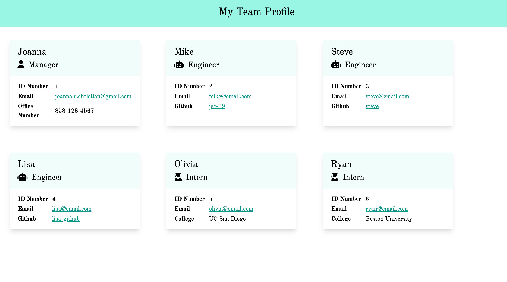

# Team Profile Generator
The team profile generator helps you build your team profile from the ground up! Use the generator to create employee profiles for Manager, Engineer, and Intern positions. It will provide with you options for emails, schools, github profile, and office number—customized for each position.

## Instructions
To install, clone the repo and save into your new repository. Once installed, run the index.js in node to get started.

## Usage
This can be used to build small team profiles that include manager, engineer, and intern positions.

## Sample

## Contribution
If you would like to contribute, please fork the repo, create your feature branch, commit your change, push to the branch, and open a pull request. Please only contribute new positions only. 

## Test
Use jest to test.

## Questions?
[Visit the project github page >](https://github.com/jsc-09/team-profile-generator) 
[View the video here >](https://drive.google.com/file/d/1N9zOLHQjczVBod11U-HyEPojlMp7m5kv/view?usp=sharing) 
Contact: <joanna.s.christian@gmail.com>